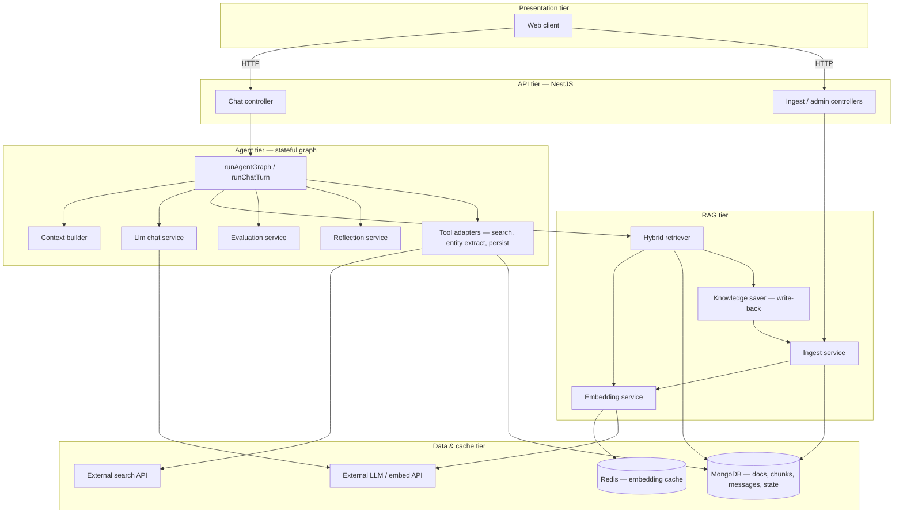
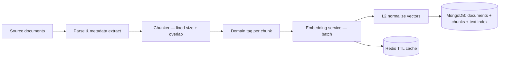
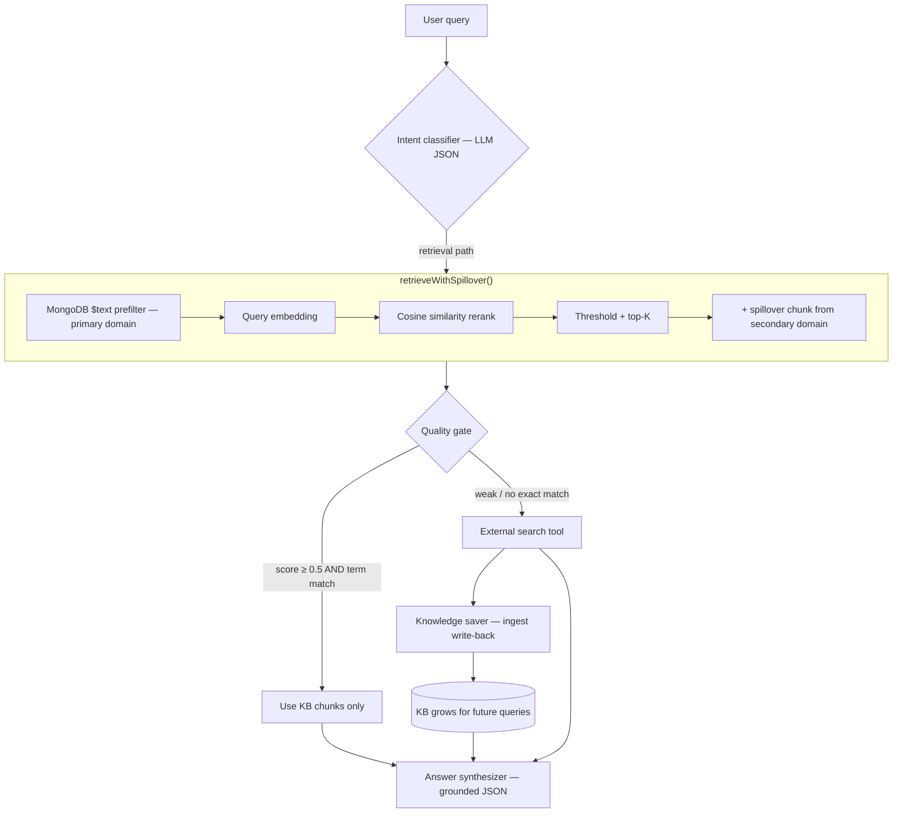
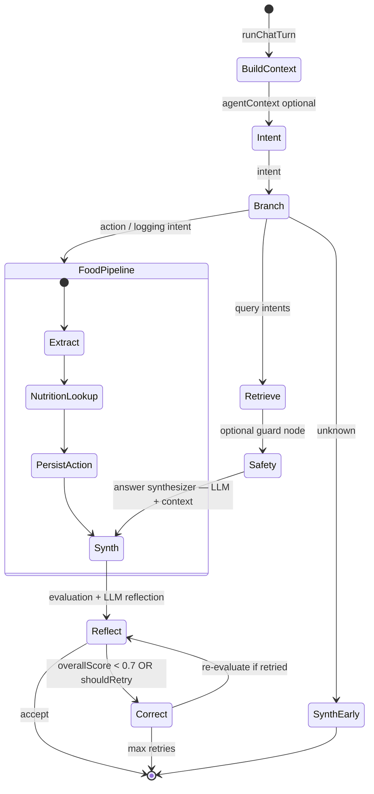
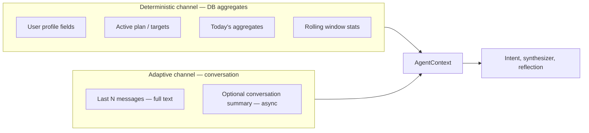
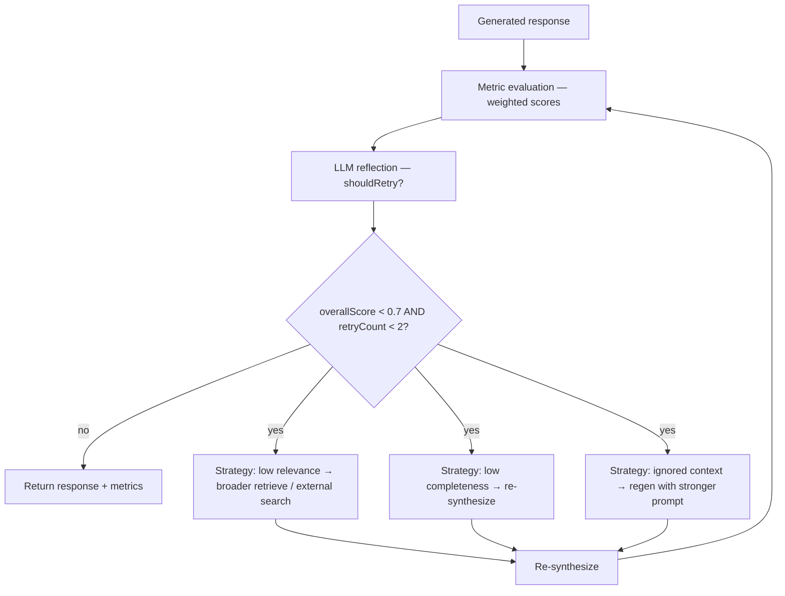
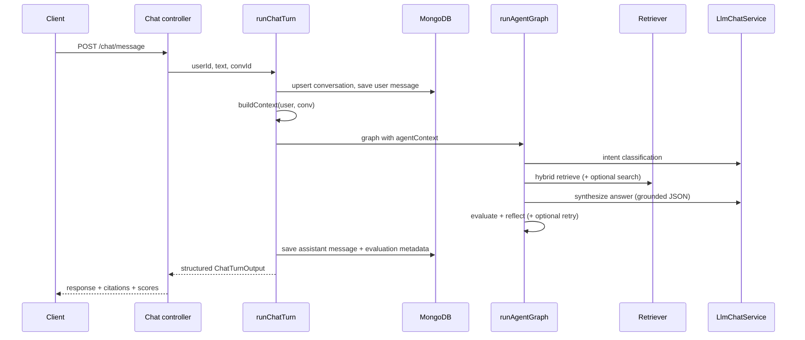

# Agentic RAG System — Implementation Architecture

This document describes **how the system is built**: orchestration, retrieval, reflection, persistence, and module boundaries. It focuses on the **Agentic RAG implementation**, not on domain-specific product features.

---

## Table of Contents

1. [System Layers (Runtime)](#1-system-layers-runtime)
2. [Offline Pipeline — Knowledge Indexing](#2-offline-pipeline--knowledge-indexing)
3. [Online Pipeline — Hybrid Retrieval & Agentic Fallback](#3-online-pipeline--hybrid-retrieval--agentic-fallback)
4. [Agent Graph — State Machine](#4-agent-graph--state-machine)
5. [Context Assembly — Two-Channel Pattern](#5-context-assembly--two-channel-pattern)
6. [Self-Reflective Quality Loop](#6-self-reflective-quality-loop)
7. [Request Lifecycle (Single Turn)](#7-request-lifecycle-single-turn)
8. [Module Boundaries](#8-module-boundaries)
9. [Architectural Patterns](#9-architectural-patterns)
10. [Generic Mental Model](#10-generic-mental-model)
11. [Configuration Reference](#11-configuration-reference)

---

## 1. System Layers (Runtime)



**Summary:** A thin API delegates to a **graph executor** that wires LLM calls, RAG, tools, and quality loops. The RAG module is consumed by both **offline ingest** and **online retrieval**.

---

## 2. Offline Pipeline — Knowledge Indexing



| Step | Implementation | Role |
|------|----------------|------|
| Chunking | `backend/src/rag/ingest.service.ts` | Splits text (~500 chars, overlap ~50), keeps section metadata |
| Embeddings | `backend/src/rag/embedding.service.ts` | Calls external embed API; caches by text hash in Redis |
| Storage | `document.schema.ts`, `chunk.schema.ts` | Documents + chunks with `domain`, `embedding[]`, MongoDB `$text` index |
| Admin path | `ingest.controller.ts`, `admin.controller.ts` | HTTP-triggered (re)ingestion |

**Collections:**

- `rag_documents` — source document metadata
- `rag_chunks` — chunked text, embeddings, domain, optional metadata (sections, tags)

---

## 3. Online Pipeline — Hybrid Retrieval & Agentic Fallback



### Hybrid RAG steps

1. **Keyword stage** — MongoDB full-text search narrows candidates (`retriever.service.ts`).
2. **Semantic stage** — query embedding vs chunk embeddings, cosine similarity (`utils/cosine.ts`).
3. **Domain routing** — primary domain from intent + optional spillover from the secondary domain.
4. **Agentic extension** — if retrieval quality fails, call **external search**, then **persist results** via `knowledge-saver.service.ts` (self-expanding knowledge base).

### Quality gate (retriever node)

Before falling back to external search, the retriever node checks:

- `hasGoodResults` — at least one chunk with similarity score ≥ 0.5
- `hasExactMatch` — key query terms appear in retrieved chunk text

External search runs when: `(!hasGoodResults || !hasExactMatch)` and the intent is eligible for retrieval.

---

## 4. Agent Graph — State Machine

The graph is a **hand-rolled sequential state machine** in `backend/src/agent/graph.ts` (not a LangGraph runtime library). A shared `GraphState` object is passed from node to node.



### Shared state (`GraphState`)

| Field group | Fields | Purpose |
|-------------|--------|---------|
| Input | `userQuery`, `agentContext` | Raw query + assembled context |
| Routing | `intent` | LLM-classified intent category |
| RAG | `primaryDocs`, `spilloverDocs`, `tavilyResults`, `usedTavily` | Retrieved and external evidence |
| Guard | `safetyLevel` | Rule-based escalation level |
| Output | `response` | Structured JSON (summary, steps, citations) |
| Quality loop | `evaluation`, `reflection`, `retryCount`, `needsContextRetry` | Metrics and retry control |
| Action branch | `foodLogging` (optional) | Entity extraction, lookup, persist state |

### Node reference

| Node | Type | File / service | Mechanism |
|------|------|----------------|-----------|
| Context builder | Pre-graph | `context-builder.service.ts` | Loads deterministic DB state + recent message window |
| Intent classifier | LLM | `intentClassifierNode` | Strict JSON via `LlmChatService.chatJSON()` |
| Action branch | Tools + DB | `foodExtractionNode`, `nutritionLookupNode`, `foodLoggingNode` | Extract → lookup → persist (conditional on intent) |
| Retriever | RAG + tool | `retrieverNode` | Hybrid search + conditional external search + KB write-back |
| Safety guard | Rules | `safetyGuardNode` | Keyword/red-flag logic on query + chunks (no LLM) |
| Answer synthesizer | LLM | `answerSynthesizerNode` | Prompt from chunks, search results, conversation, user state; structured JSON output |
| Reflection | Metrics + LLM | `reflectionNode` | `EvaluationService` + `ReflectionService` |
| Self-correction | Loop | `selfCorrectionNode` | Re-retrieve, re-synthesize, or context-aware regen (max 2 retries) |

### Graph entry points

| Function | Responsibility |
|----------|----------------|
| `runAgentGraph()` | Executes nodes for a single query; returns response + docs + metrics |
| `runChatTurn()` | Persistence wrapper: conversation, messages, context build, graph run, optional summarization trigger |

---

## 5. Context Assembly — Two-Channel Pattern



**Design choices:**

- **Deterministic channel** — factual numbers from database aggregates (no LLM arithmetic).
- **Adaptive channel** — fixed recent-message window for dialogue continuity; optional async summarization when message count exceeds a threshold.

Built by `ContextBuilderService.buildContext()` before `runAgentGraph()` is invoked.

---

## 6. Self-Reflective Quality Loop



### Evaluation metrics (`evaluation.service.ts`)

| Metric | Weight | Measures |
|--------|--------|----------|
| Relevance | 30% | Retrieved docs match query (term overlap + similarity scores) |
| Clarity | 25% | Summary length, presence of steps, not a fallback message |
| Completeness | 25% | Answer length, steps count, citations, query keywords in summary |
| Citation quality | 20% | Citation count and alignment with retrieved docs |

**Overall score** = weighted sum. **Threshold: 0.7** — below triggers `selfCorrectionNode` when `reflection.shouldRetry` is also true and `retryCount < 2`.

### Correction strategies

| Trigger | Action |
|---------|--------|
| `relevance < 0.6` | Broader retrieval (6 primary + 2 spillover); optional external search if not yet used |
| `completeness < 0.6` | Re-run answer synthesizer with same context |
| `needsContextRetry` | Re-synthesize with stronger conversation-context emphasis in prompt |

After correction, `reflectionNode` runs again to produce updated metrics.

---

## 7. Request Lifecycle (Single Turn)



Persistence is part of `runChatTurn`, not the RAG module alone. Evaluation metrics and `retryCount` are stored on the assistant message document.

---

## 8. Module Boundaries

```
backend/src/
├── chat/          → HTTP, conversation/message persistence
├── agent/         → graph.ts (orchestrator), LLM, reflection, tools, context
├── rag/           → ingest, embed, retrieve, knowledge write-back
├── common/        → config, redis, rate limit
├── diet/          → domain-specific state (consumed by context builder / action branch)
└── utils/         → cosine similarity

frontend/src/      → Web UI (chat, admin ingest UI)
```

| Concern | Primary files |
|---------|----------------|
| Graph orchestration | `agent/graph.ts` |
| Hybrid retrieval | `rag/retriever.service.ts` |
| Embeddings | `rag/embedding.service.ts` |
| KB growth from search | `rag/knowledge-saver.service.ts` |
| HTTP entry | `chat/chat.controller.ts` → `runChatTurn()` |
| Context | `agent/context-builder.service.ts` |
| External search tool | `agent/tavily-mcp.service.ts` |
| Quality | `agent/evaluation.service.ts`, `agent/reflection.service.ts` |

### NestJS modules

| Module | Imports | Exports to graph |
|--------|---------|------------------|
| `AgentModule` | `RagModule`, `CommonModule`, `DietModule` | LLM, Tavily, evaluation, reflection, context, food tracking |
| `RagModule` | Mongo, Redis, Common | Retriever, ingest, embedding, knowledge saver |
| `ChatModule` | Agent, Rag, Diet | `ChatController` |

---

## 9. Architectural Patterns

| Pattern | Implementation in this codebase |
|---------|----------------------------------|
| **Agentic RAG** | Retrieve → assess quality → optionally search externally → write back to KB → synthesize |
| **Hybrid search** | MongoDB text index prefilter + dense vector cosine rerank |
| **Stateful agent** | `GraphState` threaded through pure async node functions |
| **Tool use** | Conditional branches: external search API, entity extraction, DB writes inside the graph |
| **Self-RAG / reflection** | Post-generation scoring + LLM reflection + retry loop with strategy selection |
| **Grounded generation** | LLM constrained to excerpts + structured JSON schema with citations |
| **Self-expanding KB** | External search results ingested via `KnowledgeSaverService` for future retrieval |
| **Two-channel context** | Deterministic DB state + adaptive conversation window |

---

## 10. Generic Mental Model

```
[Sources] → ingest → [Vector + text index]
                              ↑ write-back (knowledge saver)
User → API → context + graph → retrieve → (fallback search) → synthesize → reflect → (retry?) → persist → user
                    ↑__________________________LLM gateway__________________________|
```

**Offline:** Documents become chunked, embedded, and indexed.

**Online:** Each turn builds context, runs the graph (classify → retrieve/tools → synthesize → evaluate), optionally corrects, then persists messages and metrics.

---

## 11. Configuration Reference

Key environment variables (see `backend/backend.env.example`):

```env
# RAG
RAG_TOP_K=5
RAG_SIMILARITY_THRESHOLD=0.3
CHUNK_SIZE=500
CHUNK_OVERLAP=50
EMBED_MODEL=text-embedding-nomic-embed-text-v1.5

# LLM (e.g. LM Studio)
LLM_BASE_URL=...
LLM_MODEL=...

# Conversation context
CONVERSATION_CONTEXT_ENABLED=true
CONVERSATION_RECENT_MESSAGES=3
CONVERSATION_SUMMARIZE_AFTER=20
ROLLING_WINDOW_DAYS=7

# Optional: external search (agentic fallback)
TAVILY_API_KEY=...

# Infrastructure
MONGODB_URI=...
REDIS_URL=...
```

### Hardcoded thresholds (in code)

| Constant | Value | Location |
|----------|-------|----------|
| Overall quality threshold | 0.7 | `selfCorrectionNode`, `evaluation.service.ts` |
| Per-metric correction threshold | 0.6 | `selfCorrectionNode` |
| Max self-correction retries | 2 | `selfCorrectionNode` |
| Retrieval “good result” score | 0.5 | `retrieverNode` |

---

## Related Documentation

| Document | Focus |
|----------|-------|
| [LANGGRAPH.md](./LANGGRAPH.md) | Detailed node-by-node graph behavior and examples |
| [AGENTIC_AI_COMPONENTS.md](./AGENTIC_AI_COMPONENTS.md) | Data prep, RAG, reflection, tools, evaluation deep dive |
| [CONTEXT_ARCHITECTURE.md](./CONTEXT_ARCHITECTURE.md) | Context builder and conversation handling |
| [MEMORY_MANAGEMENT.md](./MEMORY_MANAGEMENT.md) | Summarization and long conversation handling |
| [backend/README.md](./backend/README.md) | Backend setup and API overview |

---

## Summary

This system implements an **Agentic RAG** stack: hybrid retrieval with quality-gated external fallback and knowledge write-back, orchestrated by a **reflective state-machine agent** that evaluates its own outputs and retries with targeted strategies. Separation of concerns keeps **RAG indexing/retrieval**, **agent reasoning**, and **API/persistence** in distinct modules while sharing a single `GraphState` through the execution path.
